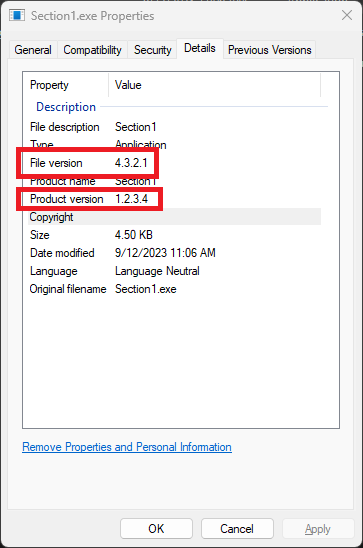
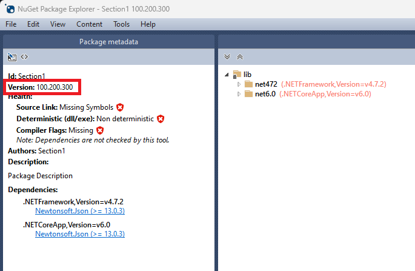
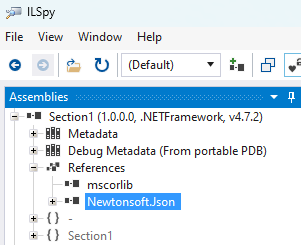

# Assembly versioning

- [Assembly versioning](#assembly-versioning)
  - [Part 1: Understanding and identifying version identifiers](#part-1-understanding-and-identifying-version-identifiers)
    - [Key takeaways of part 1](#key-takeaways-of-part-1)
  - [Part 2: Identifying dependencies and their assembly versions](#part-2-identifying-dependencies-and-their-assembly-versions)
    - [Key takeaways of part 2](#key-takeaways-of-part-2)
  - [Next Steps](#next-steps)
  - [Resources](#resources)

We're going to start by learning the following:

- How .NET assemblies are versioned?
- How to identify assembly versions?
- How to identify what other versions of assemblies an assembly depends on?

Make sure you have installed the [prerequisites](../README.md#prerequisites) before beginning.

## Part 1: Understanding and identifying version identifiers

Let's start by examining the details of the `Section1` application in this folder. Open the
[Section1.csproj](./Section1.csproj) file in a text editor and locate the `PropertyGroup` with the
`Assembly version information` comment above.

```xml
  <!-- Assembly version information -->
  <PropertyGroup>
    <Version>1.2.3.4</Version>
    <AssemblyVersion>1.0.0.0</AssemblyVersion>
    <FileVersion>4.3.2.1</FileVersion>
    <PackageVersion>100.200.300</PackageVersion>
  </PropertyGroup>
```

You'll notice that there are 4 different version values defined. Typically, they would be more closely related. However,
for the purposes of this exercise, they are all configured to completely different version numbers. This has been done to demonstrate that they are all independent and are not required to be the same as well as to make their use more
obvious.

Build the application in this folder by navigating to the `/section1` folder of this repository in your shell
(PowerShell or Command Prompt) and running `dotnet build`. You should see green output indicating `Build succeeded`.

Now, open the `bin/Debug/net472/Section1.exe` file in [ILSpy][ilspy].

> **Tip:**
>
> If [ILSpy][ilspy] is available on your path, you can simply run `ilspy .\bin\Debug\net472\Section1.exe`.
>
> Note: The availability of `ilspy` on your path depends on how it was installed and the options selected during installation.

You should see something similar to the following:

```csharp
// C:\Users\me\repos\DemystifyingBindingRedirects\section1\bin\Debug\net472\Section1.exe
// Section1, Version=1.0.0.0, Culture=neutral, PublicKeyToken=null
// Global type: <Module>
// Entry point: Section1.Program.Main
// Architecture: AnyCPU (64-bit preferred)
// Runtime: v4.0.30319
// This assembly was compiled using the /deterministic option.
// Hash algorithm: SHA1
// Debug info: Loaded from portable PDB: C:\Users\me\repos\DemystifyingBindingRedirects\section1\bin\Debug\net472\Section1.pdb

using System.Diagnostics;
using System.Reflection;
using System.Runtime.CompilerServices;
using System.Runtime.Versioning;

[assembly: CompilationRelaxations(8)]
[assembly: RuntimeCompatibility(WrapNonExceptionThrows = true)]
[assembly: Debuggable(/*Could not decode attribute arguments.*/)]
[assembly: TargetFramework(".NETFramework,Version=v4.7.2", FrameworkDisplayName = ".NET Framework 4.7.2")]
[assembly: AssemblyCompany("Section1")]
[assembly: AssemblyConfiguration("Debug")]
[assembly: AssemblyFileVersion("4.3.2.1")]
[assembly: AssemblyInformationalVersion("1.2.3.4")]
[assembly: AssemblyProduct("Section1")]
[assembly: AssemblyTitle("Section1")]
[assembly: AssemblyVersion("1.0.0.0")]
```

In this output, you can see where each of the first 3 version numbers defined in the `csproj` file manifest.

The `Version` property value manifests as the `AssemblyInformationalVersion` attribute. The `AssemblyVersion` property
value manifests in the assembly information in the comment at the top
(`Section1, Version=1.0.0.0, Culture=neutral, PublicKeyToken=null`) and also in the `AssemblyVersion` attribute. The
`FileVersion` property value manifests as the `AssemblyFileVersion` attribute.

We can also view some of the version information by opening the **Properties** dialog for the file in Windows. Run
`start .\bin\Debug\net472\` to open the folder in Windows Explorer. Right click `Section1.exe`, select **Properties**, and then select the **Details** tab.



> **Tip:**
>
> You can also view much of this same information by running `Get-Item .\bin\Debug\net472\Section1.exe | Format-List *` in PowerShell.

You'll see values from both the `Version` and `FileVersion` properties, but not the `AssemblyVersion` or the `PackageVersion`.

So far, we have not seen the value of the `PackageVersion` property manifest. That is because that version number is
specific to the package, which is completely independent. The project you build is configured to automatically create a
NuGet package from the project. Open `bin/Debug/Section1.100.200.300.nupkg` using
[NuGet Package Explorer][nuget-package-explorer].

> **Tip:**
>
> If [NuGet Package Explorer][nuget-package-explorer] is available on your path, you can simply run `NuGetPackageExplorer .\bin\Debug\Section1.100.200.300.nupkg`.
>
> Note: The availability of `NuGetPackageExplorer` on your path depends on how it was installed and the options selected during installation.



Here, you'll see the `PackageVersion` property value manifesting as the package version.

Package version numbers are completely independent of other version numbers.

### Key takeaways of part 1

- There are many different version numbers that can manifest in a .NET project or assembly. They are not required to match and each are used differently.
- For the purposes of understanding binding redirects, the **Assembly Version** is the most relevant.

## Part 2: Identifying dependencies and their assembly versions

The project you built previously has some code that relies on a library that comes from the `Newtonsoft.Json` package
to convert the array of any arguments passed to JSON format and writes tha to the console.

If we look at the contents of the `Section1.csproj` file in a text editor, we'll see a `PackageReference` item including
the `Newtonsoft.Json` package version `13.0.3`.

```xml
  <ItemGroup>
    <PackageReference Include="Newtonsoft.Json" Version="13.0.3" />
  </ItemGroup>
```

NuGet has downloaded the `Newtonsoft.Json` package version `13.0.3` and automatically added a reference to the assembly to the project. The assembly was included in the build output. Let's inspect the details of that assembly by opening the file in [ILSpy][ilspy].

> **Tip:**
>
> If [ILSpy][ilspy] is available on your path, you can simply run `ilspy .\bin\Debug\net472\Newtonsoft.Json.dll`.
>
> Note: The availability of `ilspy` on your path depends on how it was installed and the options selected during installation.

You should see something similar to the following:

```csharp
// C:\Users\me\repos\DemystifyingBindingRedirects\section1\bin\Debug\net472\Newtonsoft.Json.dll
// Newtonsoft.Json, Version=13.0.0.0, Culture=neutral, PublicKeyToken=30ad4fe6b2a6aeed
// Global type: <Module>
// Architecture: AnyCPU (64-bit preferred)
// Runtime: v4.0.30319
// This assembly is signed with a strong name key.
// This assembly was compiled using the /deterministic option.
// Hash algorithm: SHA1
// Public key: 0024000004800000940000000602000000240000525341310004000001000100f561df277c6c0b497d629032b410cdcf286e537c054724f7ffa0164345f62b3e642029d7a80cc351918955328c4adc8a048823ef90b0cf38ea7db0d729caf2b633c3babe08b0310198c1081995c19029bc675193744eab9d7345b8a67258ec17d112cebdbbb2a281487dceeafb9d83aa930f32103fbe1d2911425bc5744002c7

using System;
using System.Diagnostics;
using System.Reflection;
using System.Resources;
using System.Runtime.CompilerServices;
using System.Runtime.InteropServices;
using System.Runtime.Versioning;
using System.Security;

[assembly: CompilationRelaxations(8)]
[assembly: RuntimeCompatibility(WrapNonExceptionThrows = true)]
[assembly: Debuggable(/*Could not decode attribute arguments.*/)]
[assembly: AllowPartiallyTrustedCallers]
[assembly: InternalsVisibleTo("Newtonsoft.Json.Schema, PublicKey=0024000004800000940000000602000000240000525341310004000001000100f561df277c6c0b497d629032b410cdcf286e537c054724f7ffa0164345f62b3e642029d7a80cc351918955328c4adc8a048823ef90b0cf38ea7db0d729caf2b633c3babe08b0310198c1081995c19029bc675193744eab9d7345b8a67258ec17d112cebdbbb2a281487dceeafb9d83aa930f32103fbe1d2911425bc5744002c7")]
[assembly: InternalsVisibleTo("Newtonsoft.Json.Tests, PublicKey=0024000004800000940000000602000000240000525341310004000001000100f561df277c6c0b497d629032b410cdcf286e537c054724f7ffa0164345f62b3e642029d7a80cc351918955328c4adc8a048823ef90b0cf38ea7db0d729caf2b633c3babe08b0310198c1081995c19029bc675193744eab9d7345b8a67258ec17d112cebdbbb2a281487dceeafb9d83aa930f32103fbe1d2911425bc5744002c7")]
[assembly: InternalsVisibleTo("Newtonsoft.Json.Dynamic, PublicKey=0024000004800000940000000602000000240000525341310004000001000100cbd8d53b9d7de30f1f1278f636ec462cf9c254991291e66ebb157a885638a517887633b898ccbcf0d5c5ff7be85a6abe9e765d0ac7cd33c68dac67e7e64530e8222101109f154ab14a941c490ac155cd1d4fcba0fabb49016b4ef28593b015cab5937da31172f03f67d09edda404b88a60023f062ae71d0b2e4438b74cc11dc9")]
[assembly: AssemblyTrademark("")]
[assembly: ComVisible(false)]
[assembly: Guid("9ca358aa-317b-4925-8ada-4a29e943a363")]
[assembly: CLSCompliant(true)]
[assembly: TargetFramework(".NETFramework,Version=v4.5", FrameworkDisplayName = ".NET Framework 4.5")]
[assembly: AssemblyCompany("Newtonsoft")]
[assembly: AssemblyConfiguration("Release")]
[assembly: AssemblyCopyright("Copyright &copy; James Newton-King 2008")]
[assembly: AssemblyDescription("Json.NET is a popular high-performance JSON framework for .NET")]
[assembly: AssemblyFileVersion("13.0.3.27908")]
[assembly: AssemblyInformationalVersion("13.0.3+0a2e291c0d9c0c7675d445703e51750363a549ef")]
[assembly: AssemblyProduct("Json.NET")]
[assembly: AssemblyTitle("Json.NET .NET 4.5")]
[assembly: AssemblyMetadata("RepositoryUrl", "https://github.com/JamesNK/Newtonsoft.Json")]
[assembly: NeutralResourcesLanguage("en-US")]
[assembly: AssemblyVersion("13.0.0.0")]
```

In here, you'll that the **assembly version** is `13.0.0.0`. Remember, the package version number `13.0.3` is
completely separate and does not necessarily manifest in the assembly.

Now, let's open `Section1.exe` in [ILSpy][ilspy] again and see where this `Newtonsoft.Json.dll` dependency might
manifest. Under the **Assemblies** pane, expand **Section1** and then **References**. Select **Newtonsoft.Json**.



The content of the output should look something like the following:

```csharp
// Newtonsoft.Json, Version=13.0.0.0, Culture=neutral, PublicKeyToken=30ad4fe6b2a6aeed
    // Assembly reference loading information:
    // Info: Success - Found in Assembly List
    // Info: Success - Loading from: C:\Users\me\repos\DemystifyingBindingRedirects\section1\bin\Debug\net472\Newtonsoft.Json.dll
```

You'll notice that according to the `Section1.exe` assembly, it has a dependency on the `Newtonsoft.Json` assembly
version `13.0.0.0`.

Where did this version number come from? When the project was compiled, that is the assembly version of the assembly
that was being referenced. That information is stored within the assembly. This is important to understand because it
plays a key role to understanding binding redirects.

### Key takeaways of part 2

- An assembly contains the information for dependency assemblies as well as the expected assembly version.

## Next Steps

Continue the tutorial in [Section 2](../section2/README.md).

## Resources

More details on assemblies can be found in the following resources:

- [.NET assembly file format][assembly-file-format]
- [Assembly versioning][assembly-versioning]

Some additional tools that can be helpful:

- [AsmSpy][asmspy]
  - Command line tool to identify assembly references.
- [dotPeek][dotpeek]
  - Similar to [ILSpy][ilspy].
- [Telerik JustDecompile][just-decompile]
  - Similar to [ILSpy][ilspy].

[asmspy]: https://github.com/mikehadlow/AsmSpy "AsmSpy"
[assembly-file-format]: https://learn.microsoft.com/dotnet/standard/assembly/file-format ".NET assembly file format"
[assembly-versioning]: https://learn.microsoft.com/dotnet/standard/assembly/versioning "Assembly versioning"
[dotpeek]: https://www.jetbrains.com/decompiler/ "dotPeek"
[ilspy]: https://github.com/icsharpcode/ILSpy "ILSpy"
[just-decompile]: https://www.telerik.com/products/decompiler.aspx "Telerik JustDecompile"
[nuget-package-explorer]: https://github.com/NuGetPackageExplorer/NuGetPackageExplorer "NuGet Package Explorer"
