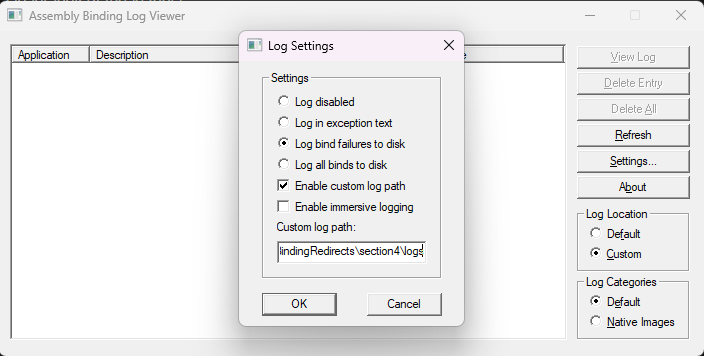
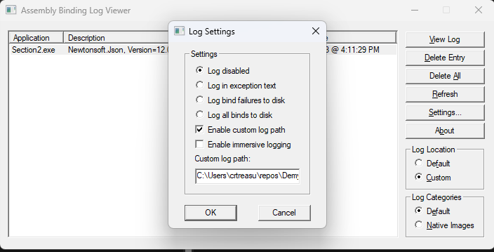
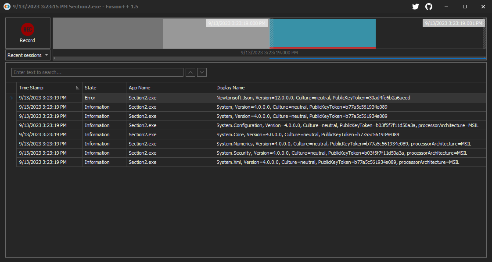

# Diagnosing issues related to binding redirects

- [Diagnosing issues related to binding redirects](#diagnosing-issues-related-to-binding-redirects)
  - [Introduction](#introduction)
  - [Part 1: Diagnose binding issues using Assembly Binding Log Viewer](#part-1-diagnose-binding-issues-using-assembly-binding-log-viewer)
  - [Part 2: Diagnose binding issues using Fusion++](#part-2-diagnose-binding-issues-using-fusion)
  - [Part 3: Capturing Fusion logs using the registry](#part-3-capturing-fusion-logs-using-the-registry)
  - [Key takeaways](#key-takeaways)
  - [Next Steps](#next-steps)
  - [Resources](#resources)

We're going to start by learning the following:

- How to diagnose binding redirect related issues using Fusion logs?
- What tools are available to help make the process easier?

Make sure you have installed the [prerequisites](../README.md#prerequisites) before beginning.

**Keep in mind** that the details discussed below are specific to .NET Framework applications and libraries. The
behavior of modern .NET 5+ (and .NET Core) runtimes and applications are quite different. We'll discuss some of these
differences in a later section.

## Introduction

There are many tools to help you diagnose binding redirect issues. We've use a few throughout this tutorial already:
[ILSpy][ilspy] and [AsmSpy][asmspy].

[ILSpy][ilspy] is a great tool for manually inspecting the assembly header information including any dependencies
and their assembly versions. Similar tools are [dotPeek][dotpeek] and [JustDecompile][just-decompile].

[AsmSpy][asmspy] is a great command line tool to quickly determine assembly conflicts.

There is also a great .NET Framework feature called Fusion logs that can help you get more information by capturing
assembly load events as the .NET Runtime attempts to load assemblies. There are a few tools to help make that process
easier: [Assembly Binding Log Viewer][assembly-binding-log-viewer] (included with Visual Studio) and
[Fusion++][fusion-plus-plus]. Let's take a closer look at how we can use these tools.

## Part 1: Diagnose binding issues using Assembly Binding Log Viewer

The [Assembly Binding Log Viewer][assembly-binding-log-viewer] comes with Visual Studio. It's fairly easy to use, but
the options aren't always all that straight forward.

To try it out:

1. Prepare a PowerShell window and navigate to `/section2`.
2. Launch an instance of **Visual Studio Developer Command Prompt** or **Visual Studio Developer PowerShell** as an
   administrator and run `fuslogvw` to open the tool.
3. Start logging binding errors:
   1. Change the **Log Location** to **Custom**.
   2. Select **Settings**, change to **Log bind failures to disk**, select **Enable custom log path**, enter a directory
      to emit the logs, and then select **OK**.

      
4. In your PowerShell window, run `.\Simulate.ps1 -RunApp -SwitchDependency`.
5. When the command stops, switch back to the tool, and stop logging:
   1. Select **Refresh** to show the logged events. You should see a single event.
   2. Select **Settings**, change to **Log disabled**, and select **OK** to stop logging events.

      
6. Select the event and then select **View Log** to open the log in your browser.

The tool writes logs in HTML format for some reason, but it should contain something similar to the following:

```error
*** Assembly Binder Log Entry  (9/13/2023 @ 3:23:19 PM) ***

The operation failed.
Bind result: hr = 0x80131040. No description available.

Assembly manager loaded from:  C:\Windows\Microsoft.NET\Framework64\v4.0.30319\clr.dll
Running under executable  C:\Users\me\repos\DemystifyingBindingRedirects\section2\bin\Debug\net472\publish\Section2.exe
--- A detailed error log follows.

=== Pre-bind state information ===
LOG: DisplayName = Newtonsoft.Json, Version=12.0.0.0, Culture=neutral, PublicKeyToken=30ad4fe6b2a6aeed
 (Fully-specified)
LOG: Appbase = file:///C:/Users/me/repos/DemystifyingBindingRedirects/section2/bin/Debug/net472/publish/
LOG: Initial PrivatePath = NULL
LOG: Dynamic Base = NULL
LOG: Cache Base = NULL
LOG: AppName = Section2.exe
Calling assembly : Section2, Version=1.0.0.0, Culture=neutral, PublicKeyToken=null.
===
LOG: This bind starts in default load context.
LOG: Using application configuration file: C:\Users\me\repos\DemystifyingBindingRedirects\section2\bin\Debug\net472\publish\Section2.exe.Config
LOG: Using host configuration file:
LOG: Using machine configuration file from C:\Windows\Microsoft.NET\Framework64\v4.0.30319\config\machine.config.
LOG: Post-policy reference: Newtonsoft.Json, Version=12.0.0.0, Culture=neutral, PublicKeyToken=30ad4fe6b2a6aeed
LOG: GAC Lookup was unsuccessful.
LOG: Attempting download of new URL file:///C:/Users/me/repos/DemystifyingBindingRedirects/section2/bin/Debug/net472/publish/Newtonsoft.Json.DLL.
LOG: Assembly download was successful. Attempting setup of file: C:\Users\me\repos\DemystifyingBindingRedirects\section2\bin\Debug\net472\publish\Newtonsoft.Json.dll
LOG: Entering run-from-source setup phase.
LOG: Assembly Name is: Newtonsoft.Json, Version=13.0.0.0, Culture=neutral, PublicKeyToken=30ad4fe6b2a6aeed
WRN: Comparing the assembly name resulted in the mismatch: Major Version
ERR: The assembly reference did not match the assembly definition found.
ERR: Run-from-source setup phase failed with hr = 0x80131040.
ERR: Failed to complete setup of assembly (hr = 0x80131040). Probing terminated.


*** Assembly Binder Log Entry  (9/13/2023 @ 3:23:19 PM) ***

The operation failed.
Bind result: hr = 0x80131040. No description available.

Assembly manager loaded from:  C:\Windows\Microsoft.NET\Framework64\v4.0.30319\clr.dll
Running under executable  C:\Users\me\repos\DemystifyingBindingRedirects\section2\bin\Debug\net472\publish\Section2.exe
--- A detailed error log follows.

=== Pre-bind state information ===
LOG: DisplayName = Newtonsoft.Json, Version=12.0.0.0, Culture=neutral, PublicKeyToken=30ad4fe6b2a6aeed
 (Fully-specified)
LOG: Appbase = file:///C:/Users/me/repos/DemystifyingBindingRedirects/section2/bin/Debug/net472/publish/
LOG: Initial PrivatePath = NULL
LOG: Dynamic Base = NULL
LOG: Cache Base = NULL
LOG: AppName = Section2.exe
Calling assembly : Section2, Version=1.0.0.0, Culture=neutral, PublicKeyToken=null.
===
LOG: This bind starts in default load context.
LOG: Using application configuration file: C:\Users\me\repos\DemystifyingBindingRedirects\section2\bin\Debug\net472\publish\Section2.exe.Config
LOG: Using host configuration file:
LOG: Using machine configuration file from C:\Windows\Microsoft.NET\Framework64\v4.0.30319\config\machine.config.
LOG: Post-policy reference: Newtonsoft.Json, Version=12.0.0.0, Culture=neutral, PublicKeyToken=30ad4fe6b2a6aeed
LOG: GAC Lookup was unsuccessful.
LOG: Attempting download of new URL file:///C:/Users/me/repos/DemystifyingBindingRedirects/section2/bin/Debug/net472/publish/Newtonsoft.Json.DLL.
LOG: Assembly download was successful. Attempting setup of file: C:\Users\me\repos\DemystifyingBindingRedirects\section2\bin\Debug\net472\publish\Newtonsoft.Json.dll
LOG: Entering run-from-source setup phase.
LOG: Assembly Name is: Newtonsoft.Json, Version=13.0.0.0, Culture=neutral, PublicKeyToken=30ad4fe6b2a6aeed
WRN: Comparing the assembly name resulted in the mismatch: Major Version
ERR: The assembly reference did not match the assembly definition found.
ERR: Run-from-source setup phase failed with hr = 0x80131040.
ERR: Failed to complete setup of assembly (hr = 0x80131040). Probing terminated.
```

The log shows what went wrong as the runtime is doing as it attempts to load the assemblies.

You can find the HTML files in the custom log output folder you configured. Feel free to delete those HTML files
when you're finished.

## Part 2: Diagnose binding issues using Fusion++

[Fusion++][fusion-plus-plus] is a modern open source version of the Assembly Binding Log Viewer. It does exactly the
same thing, just in a more modern way. Open the tool as an administrator, select **Record**, reproduce the issue,
select **Stop**, and the tool does the work to collect and present the logs.

To try it out:

1. Prepare a PowerShell window and navigate to `/section2`.
2. Launch [Fusion++][fusion-plus-plus] as an administrator and select **Record**.
3. In your PowerShell window, run `.\Simulate.ps1 -RunApp -SwitchDependency`.
4. When the command stops, select **Stop** in [Fusion++][fusion-plus-plus] to stop recording and view the events.
5. Double click the first line with an **Error** state to view the logs.



The log output should look nearly identical to that of the [Assembly Binding Log Viewer][assembly-binding-log-viewer]
in the [previous example](#part-1-diagnose-binding-issues-using-assembly-binding-log-viewer).

The tool shows a good view of the logs as the runtime was attempting to load the assemblies.

## Part 3: Capturing Fusion logs using the registry

All the other tools are really doing are manipulating a few registry keys to cause the .NET Framework runtime to write
Fusion logs. This can be done manually as well by setting the following registry keys:

| Path                              | Name       | Description                                          |
|-----------------------------------|------------|------------------------------------------------------|
| `HKLM:\Software\Microsoft\Fusion` | `ForceLog` | Set to 1 to enable logging and 0 to disable logging. |
| `HKLM:\Software\Microsoft\Fusion` | `LogPath`  | Set the log output path.                             |

> **Important:**
>
> It's important to remember to disable logging when you're finished executing your scenario.

1. Prepare a PowerShell window and navigate to `/section2`.
2. Start Fusion log recording:
   1. Open another PowerShell window as an administrator.
   2. Determine a location to write your logs.
   3. After updating the `$logPath` variable, run the following to start recording:

      ```powershell
      $logPath = '<log output directory>'
      New-Item -ItemType Directory -Force -Path $logPath | Out-Null
      Set-ItemProperty -Path HKLM:\Software\Microsoft\Fusion -Name LogPath  -Value $logPath -Type String
      Set-ItemProperty -Path HKLM:\Software\Microsoft\Fusion -Name ForceLog -Value 1        -Type DWord
      ```

3. From the first PowerShell window, run `.\Simulate.ps1 -RunApp -SwitchDependency`.
4. Stop Fusion log recording:
   1. From your administrator PowerShell window, run:

      ```powershell
      Remove-ItemProperty -Path HKLM:\Software\Microsoft\Fusion -Name ForceLog
      Remove-ItemProperty -Path HKLM:\Software\Microsoft\Fusion -Name LogPath
      ```

5. Locate the logs for `Section2.exe` in the log output folder and open the file starting with `Newtonsoft.Json` to
   see the logs.

To make the process a bit easier, there a helper script called [RecordFusionLogs.ps1](./RecordFusionLogs.ps1) that
automates much of the process for you. Repeat the process with the helper script.

1. Prepare a PowerShell window and navigate to `/section2`.
2. Open another PowerShell window as an administrator and navigate to `/section4`.
3. Start Fusion log recording:
   1. From the administrative PowerShell window, run `.\RecordFusionLogs.ps1`.
      1. You can specify the `-LogPath` parameter if you'd like to configure the output path. By default, it will write
         to a `logs` folder under the current directory.
   2. Recording will start immediately and the script will wait for you to press a key to stop the recording.
4. From the first PowerShell window, run `.\Simulate.ps1 -RunApp -SwitchDependency` and wait for the script to complete.
5. Stop Fusion log recording:
   1. From your administrator PowerShell window, press any key to stop the recording.
   2. The script will then pause asking if you want to clean up the log files.
6. Locate the logs for `Section2.exe` in the log output folder and open the file starting with `Newtonsoft.Json` to
   see the logs.
7. When you're finished examining the logs, return to the administrative PowerShell window, enter `Y`, and hit
   **Enter** to cleanup the logs and exit the script.

## Key takeaways

- Fusion logs are useful when identifying binding related issues.
- There are tools available to make the process of getting Fusion logs a bit easier.
- It's also easy to record Fusion logs using the registry.

## Next Steps

Continue the tutorial in [Section 5](../section5/README.md).

## Resources

- [AsmSpy][asmspy]
- [dotPeek][dotpeek]
- [ILSpy][ilspy]
- [JustDecompile][just-decompile]
- [Fuslogvw.exe (Assembly Binding Log Viewer)][assembly-binding-log-viewer]
- [Fusion++][fusion-plus-plus]

[assembly-binding-log-viewer]: https://learn.microsoft.com/dotnet/framework/tools/fuslogvw-exe-assembly-binding-log-viewer "Fuslogvw.exe (Assembly Binding Log Viewer)"
[asmspy]: https://github.com/mikehadlow/AsmSpy "AsmSpy"
[dotpeek]: https://www.jetbrains.com/decompiler/ "dotPeek"
[fusion-plus-plus]:https://github.com/awaescher/Fusion "Fusion++"
[ilspy]: https://github.com/icsharpcode/ILSpy "ILSpy"
[just-decompile]: https://www.telerik.com/products/decompiler.aspx "Telerik JustDecompile"
