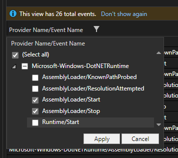
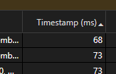
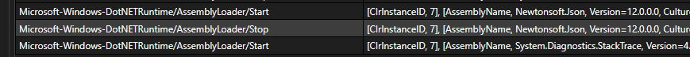
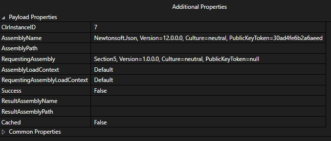

# Binding Redirects in other .NET runtimes

- [Binding Redirects in other .NET runtimes](#binding-redirects-in-other-net-runtimes)
  - [Introduction](#introduction)
  - [Part 1: Demonstration](#part-1-demonstration)
  - [Part 2: Diagnosing assembly load issues](#part-2-diagnosing-assembly-load-issues)
  - [Part 3: Resolving assemblies at runtime](#part-3-resolving-assemblies-at-runtime)
  - [Key Takeaways](#key-takeaways)
  - [Resources](#resources)

In this section, we'll lean the following:

- Are binding redirects necessary or possible in modern .NET (Core) applications?
- How to diagnose assembly load issues in modern .NET (Core) applications?
- What are the alternatives?

Make sure you have installed the [prerequisites](../README.md#prerequisites) before beginning.

## Introduction

A lot of changes occurred between .NET Framework and .NET Core. There were several changes in how the .NET runtime
loads assemblies. This tutorial won't go into detail on those changes, but you can learn more
[here][dotnet-dependency-loading]. The changes that are relevant to what we've been learning so far are essentially:

- There is no support for binding redirects in .NET Core or .NET 5+ applications.
- If an assembly is located with an assembly version greater than or equal to what's expected, it will be loaded.

## Part 1: Demonstration

As in previous sections, let's use an example to see the difference in behavior. The `/section5` directory contains a
project that is a copy from `/section2` with the `TargetFramework` changed from `net472` to `net8.0` to target .NET 8.

As before, we have our trusty [Simulate.ps1][simulate-script] script to make these experiments easier. We're going to
run 3 different scenarios:

1. Build and run the application with the dependencies it was compiled with.
2. Build and run the application with a newer version of `Newtonsoft.Json` (`13.0.0.0`).
3. Build and run the application with an older version of `Newtonsoft.Json` (`11.0.0.0`).

The first two you should remember from previous sections. The last one is new.

To run the first scenario, start up a PowerShell window and run `.\Simulate.ps1 -RunApp`.

```text
~\repos\DemystifyingBindingRedirects\section5> .\Simulate.ps1 -RunApp
Cleaning the publish output folder...
Publishing the application...
MSBuild version 17.3.2+561848881 for .NET
  Determining projects to restore...
  All projects are up-to-date for restore.
  Section5 -> C:\Users\me\repos\DemystifyingBindingRedirects\section5\bin\Debug\net8.0\Section5.dll
  Section5 -> C:\Users\me\repos\DemystifyingBindingRedirects\section5\bin\Debug\net8.0\publish\
Running the application...
["Hello","World!"]
```

The output indicates that the application works as expected, which is no surprise.

To run the second scenario, run `.\Simulate.ps1 -RunApp -SwitchDependency`. The `-SwitchDependency` parameter is going
to swap out the `Newtonsoft.Json` assembly from the `12.0.3` package with one from the `13.0.3` package.

```text
~\repos\DemystifyingBindingRedirects\section5> .\Simulate.ps1 -RunApp
Cleaning the publish output folder...
Publishing the application...
MSBuild version 17.3.2+561848881 for .NET
  Determining projects to restore...
  All projects are up-to-date for restore.
  Section5 -> C:\Users\me\repos\DemystifyingBindingRedirects\section5\bin\Debug\net8.0\Section5.dll
  Section5 -> C:\Users\me\repos\DemystifyingBindingRedirects\section5\bin\Debug\net8.0\publish\
Running the application...
["Hello","World!"]
```

The output indicates that the application works. This is a change from our experiments previously with .NET Framework
where we needed to add a binding redirect to allow loading the different assembly version.

Now, let's try the third scenario, which will use the `-SwitchDependency` parameter as before, but also use some new
parameters to change the package version we get the assembly from. We're going to add to the command the
`-SwitchDependencyPackageVersion` parameter with the `'11.0.2'` value to get the assembly from the `11.0.2` package.
We're also going to add the `-SwitchDependencyTfm` parameter with the `'netstandard2.0'` value to retrieve the assembly
targeting `netstandard2.0` since the `11.0.2` version of the package doesn't contain a library targeting .NET 6.

In PowerShell, run `.\Simulate.ps1 -RunApp -SwitchDependency -SwitchDependencyPackageVersion '11.0.2' -SwitchDependencyTfm 'netstandard2.0'`.

```text
~\repos\DemystifyingBindingRedirects\section5> .\Simulate.ps1 -RunApp -SwitchDependency -SwitchDependencyPackageVersion '11.0.2' -SwitchDependencyTfm 'netstandard2.0'
Cleaning the publish output folder...
Publishing the application...
MSBuild version 17.3.2+561848881 for .NET
  Determining projects to restore...
  All projects are up-to-date for restore.
  Section5 -> C:\Users\me\repos\DemystifyingBindingRedirects\section5\bin\Debug\net8.0\Section5.dll
  Section5 -> C:\Users\me\repos\DemystifyingBindingRedirects\section5\bin\Debug\net8.0\publish\
Switching the dependency...
Downloading newer dependency...
Extracting the dependency...
Overwriting the dependency from package version 12.0.3 with 11.0.2...
Running the application...
Unhandled exception. System.IO.FileLoadException: Could not load file or assembly 'Newtonsoft.Json, Version=12.0.0.0, Culture=neutral, PublicKeyToken=30ad4fe6b2a6aeed'. The located assembly's manifest definition does not match the assembly reference. (0x80131040)
File name: 'Newtonsoft.Json, Version=12.0.0.0, Culture=neutral, PublicKeyToken=30ad4fe6b2a6aeed'
```

Ah. Now there's our old friend the `System.IO.FileLoadException`. This time, we got an exception because the .NET
runtime decided that this particular assembly version was not appropriate.

There's not a way to override this without recompiling like there was in .NET Framework. But, this is a good thing as
downgrades are not generally considered safe. The same risks we discussed previously apply when performing upgrades. If
APIs change, you could experience runtime errors that can be difficult to debug.

## Part 2: Diagnosing assembly load issues

The tooling we discussed in [Section 4][section-4] does not apply to .NET Core or .NET 5+ applications. The alternative
is a tool called [dotnet-trace][dotnet-trace]. You can learn more about the usage of the tool at
[Collect detailed assembly loading information][collect-assembly-loading-info].

This next step assumes the last command you ran was scenario 3 from [part 1](#part-1-demonstration). If not, go back and
run the command for scenario 3 in [part 1](#part-1-demonstration) to get the application into a failing state.

To run the tool and capture diagnostic events for our process, run
`dotnet-trace collect --providers Microsoft-Windows-DotNETRuntime:4 --output section5.nettrace -- .\bin\Debug\net8.0\publish\Section5.exe Hello World!`.

This will emit a `section5.nettrace` file in the current directory. The [documentation][collect-assembly-loading-info]
suggests using a tool called **PerfView** to open the `section5.nettrace` file, but the latest version appears to fail to do so.
Instead, you can open the file using Visual Studio and view the events there.

After opening the trace in Visual Studio, you should see a list of events. Use the filter button next to the
"Provider Name/Event Name" header to filter to the `AssemblyLoader/Start` and `AssemblyLoader/Stop` events.



Next, sort the events by the "Timestamp" in ascending order.



Now, locate the `AssemblyLoader/Start` and `AssemblyLoader/Stop` events related to the `Newtonsoft.Json` assembly.



Select the `AssemblyLoader/Stop` event to view the details:



> **Note:**
>
> At one point while building the tutorial, `dotnet-trace` was not emitting a trace containing the expected events.
> After restarting the computer and trying again, it began working as expected. The cause of that at this point is
> unknown, but might be helpful if you experience similar issues.

The nice thing about the `dotnet-trace` tool is that it is cross-platform. This is a great benefit since modern .NET
(Core) applications can be cross-platform. You can then capture a trace on other platforms like Linux.

## Part 3: Resolving assemblies at runtime

There is, however, an option to override assembly loading issues at runtime.

> **Warning:**
>
> The technique demonstrated here is not a recommendation, but provided for informational purposes. The code snippets
> are simple to make a point and not meant to demonstrate the proper way of locating or verifying an assembly's identity
> before loading and executing it. There are security implications to consider. The effort to do this properly and
> safely is out of scope for this training.

Open [`Program.cs`](./Program.cs) in a text editor.

Move the contents of the `Main` method into a new method called `Run` and call it from the `Main` method passing the
`args` parameter. This step may seem counterintuitive, but it's very important as it ensures the `Newtonsoft.Json`
assembly isn't loaded before we have a chance to hook up the ability to deal with it.

```csharp
internal static class Program
{
    private static void Main(string[] args)
    {
        Run(args);
    }

    private static void Run(string[] args)
    {
        Console.WriteLine("Starting.");
        string json = JsonConvert.SerializeObject(args);
        Console.WriteLine(json);
    }
}
```

Next, add the following `using` statements:

```csharp
using System.IO;
using System.Reflection;
using System.Runtime.Loader;
```

Then, first thing in the `Main` method, add the following code snippet:

```csharp
AssemblyLoadContext.Default.Resolving += (context, name) =>
{
    Console.WriteLine($"Attempting to resolve: {name}");

    if (name.Name == "Newtonsoft.Json")
    {
        string assemblyPath = Path.Join(AppContext.BaseDirectory, "Newtonsoft.Json.dll");
        Assembly assembly = context.LoadFromAssemblyPath(assemblyPath);
        return assembly;
    }

    return null;
};
```

Let's talk about what this code does real quick. This code registers for the `Resolving` even on the default
[AssemblyLoadContext][assemblyloadcontext] that will be called when the runtime fails to load an assembly using the
traditional method. The handler is given the chance to load and return an assembly or return `null` if one can't be
resolved. In this case, if the assembly resolver fails to load `Newtonsoft.Json` for whatever reason, we load the
instance of `Newtonsoft.Json.dll` that is located in the application base directory and return it.

> **Warning:**
>
> Again, the technique demonstrated here is not a recommendation, but provided for informational purposes. The code
> snippets are simple to make a point and not meant to demonstrate the proper way of locating or verifying an assembly's
> identity before loading and executing it. There are security implications to consider. The effort to do this properly
> and safely is out of scope for this training. **DO NOT** just copy paste this snippet into a production application.
> It is not sufficient.

You should end up with a file that looks something like this:

```csharp
namespace Section5;

using Newtonsoft.Json;

using System;
using System.IO;
using System.Reflection;
using System.Runtime.Loader;

internal static class Program
{
    private static void Main(string[] args)
    {
        AssemblyLoadContext.Default.Resolving += (context, name) =>
        {
            Console.WriteLine($"Attempting to resolve: {name}");

            if (name.Name == "Newtonsoft.Json")
            {
                string assemblyPath = Path.Join(AppContext.BaseDirectory, "Newtonsoft.Json.dll");
                Assembly assembly = context.LoadFromAssemblyPath(assemblyPath);
                Console.WriteLine($"Loading assembly:      {assembly}");
                return assembly;
            }

            return null;
        };

        Run(args);
    }

    private static void Run(string[] args)
    {
        Console.WriteLine("Starting.");
        string json = JsonConvert.SerializeObject(args);
        Console.WriteLine(json);
    }
}
```

Now, let's run our 3 scenarios again from [part 1](#part-1-demonstration).

To run the first scenario, start up a PowerShell window and run `.\Simulate.ps1 -RunApp`. The output should appear just
as before.

To run the second scenario, run `.\Simulate.ps1 -RunApp -SwitchDependency`. Again, the output should appear just as
before.

Now, for the third scenario, run `.\Simulate.ps1 -RunApp -SwitchDependency -SwitchDependencyPackageVersion '11.0.2' -SwitchDependencyTfm 'netstandard2.0'`. This scenario failed previously, but now succeeds with the following new output:

```text
Running the application...
Attempting to resolve: Newtonsoft.Json, Version=12.0.0.0, Culture=neutral, PublicKeyToken=30ad4fe6b2a6aeed
Loading assembly:      Newtonsoft.Json, Version=11.0.0.0, Culture=neutral, PublicKeyToken=30ad4fe6b2a6aeed
["Hello","World!"]
```

The code in the `Resolving` event was triggered because the runtime couldn't find assembly version `12.0.0.0`. Our
event handler loaded assembly version `11.0.0.0` and the program executed successfully.

## Key Takeaways

- Binding redirects are not applicable to .NET Core or .NET 5+ applications.
- When assemblies can't be loaded, there is a method to resolve assemblies at runtime.

## Resources

- [About System.Runtime.Loader.AssemblyLoadContext][assemblyloadcontext]
- [Collect detailed assembly loading information][collect-assembly-loading-info]
- [Dependency loading in .NET][dotnet-dependency-loading]

[assemblyloadcontext]: https://learn.microsoft.com/dotnet/core/dependency-loading/understanding-assemblyloadcontext "About System.Runtime.Loader.AssemblyLoadContext"
[collect-assembly-loading-info]: https://learn.microsoft.com/dotnet/core/dependency-loading/collect-details "Collect detailed assembly loading information"
[dotnet-dependency-loading]: https://learn.microsoft.com/dotnet/core/dependency-loading/overview "Dependency loading in .NET"
[dotnet-trace]: https://learn.microsoft.com/dotnet/core/diagnostics/dotnet-trace "dotnet-trace performance analysis utility"
[section-4]: ..\section4\README.md "Section 4"
[simulate-script]: .\Simulate.ps1 "Simulate.ps1"
